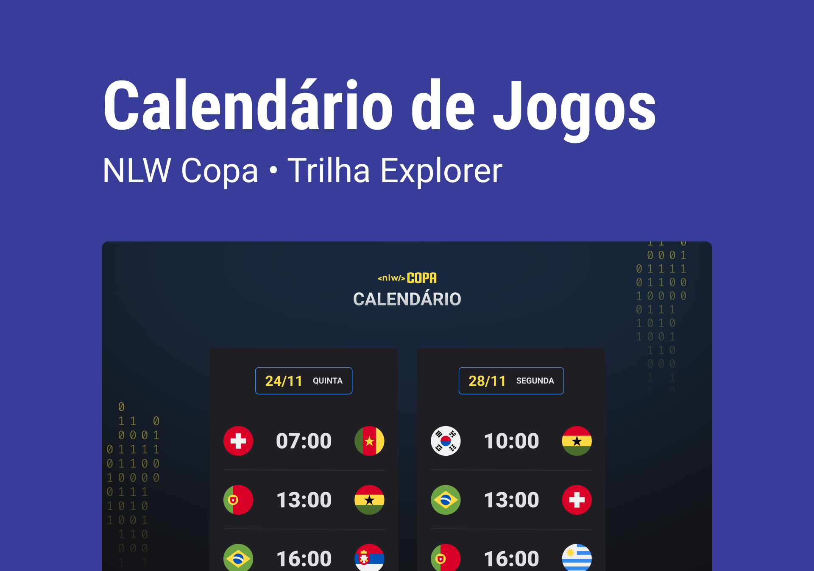

<h1 align="canter"> NLW #10 Copa  </h1>

 
  Projeto feito no evento da rocketseat.

  <a href="#-tecnologias"> Tecnologias </a> &nbsp;&nbsp;&nbsp; | &nbsp;&nbsp;&nbsp;
  <a href="#-projeto"> Projeto </a> &nbsp;&nbsp;&nbsp; | &nbsp;&nbsp;&nbsp;
  <a href="#-layout"> Layout </a> &nbsp;&nbsp;&nbsp; | &nbsp;&nbsp;&nbsp;

  

## Tecnologias

Esse projeto foi desenvolvido com as seguintes tecnologias:

- HTML
- CSS
- JavaScript
- Git e GitHub

## Projeto

O Calendário da Copa é um projeto que mostra os jogos da Copa de 2022.

## Layout

Você pode vizualizar o layout do projeto através [DESSE LINK](https://www.figma.com/community/file/1169028052212317700)
